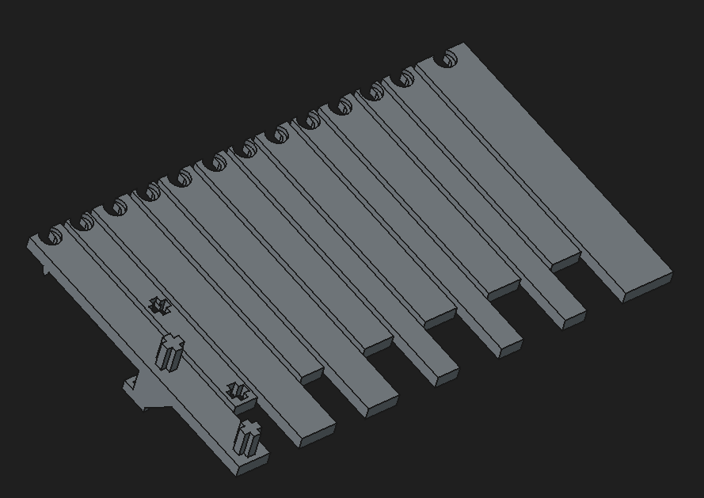
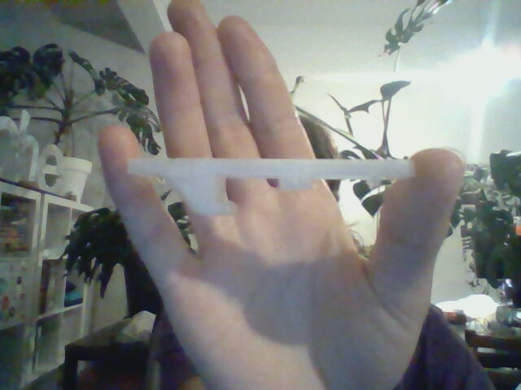
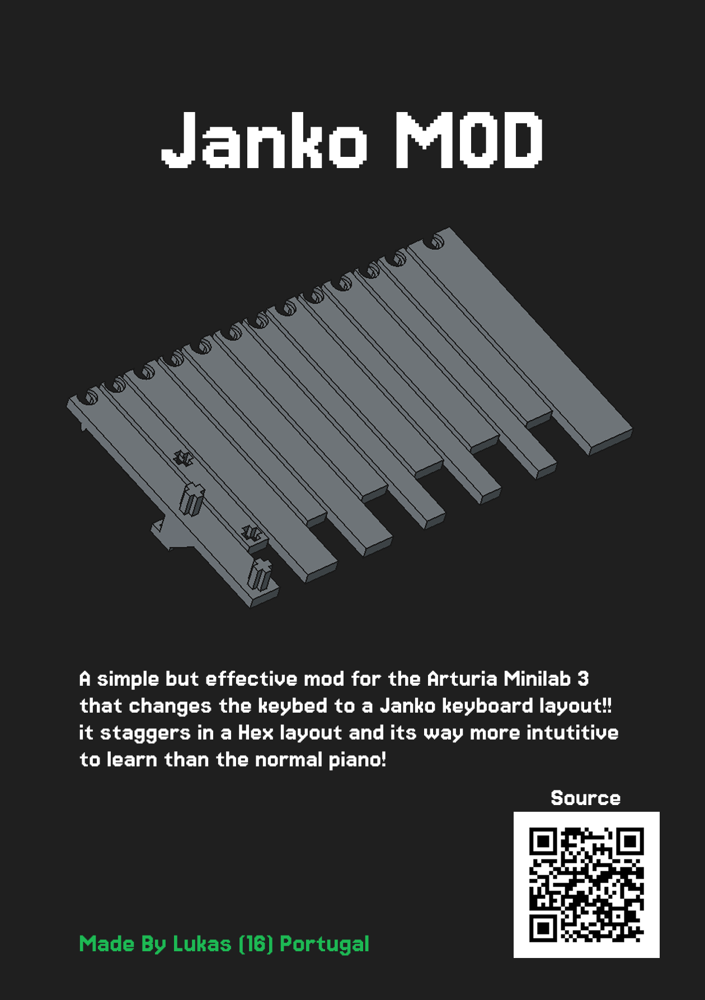

# Arturia Minilab 3 Janko Mod

> A 3D-printed Janko layout keybed replacement for the Arturia Minilab 3.

---

This is a Janko layout mod for the Arturia Minilab 3, designed in FreeCAD. The Janko keyboard layout makes the keys in a honeycomb pattern where each row is offset by a half step, making scales and chords the same shape regardless of position

The mod replaces the normal keys with 3D printed Janko keys.

## BOM

Part | Quantity | Price | Link
--- | --- | --- | ---
3D Printed Keys | 61 | N/A | N/A
3D Printed Frame | 1 | N/A | N/A
Arturia Minilab 3 | 1 | ~$100 | [arturia.com](https://www.arturia.com/products/hardware-synths/minilab-3)

**Total:** ~$100 + filament

## Overview

**CAD Model**

**key**

**Zine**

