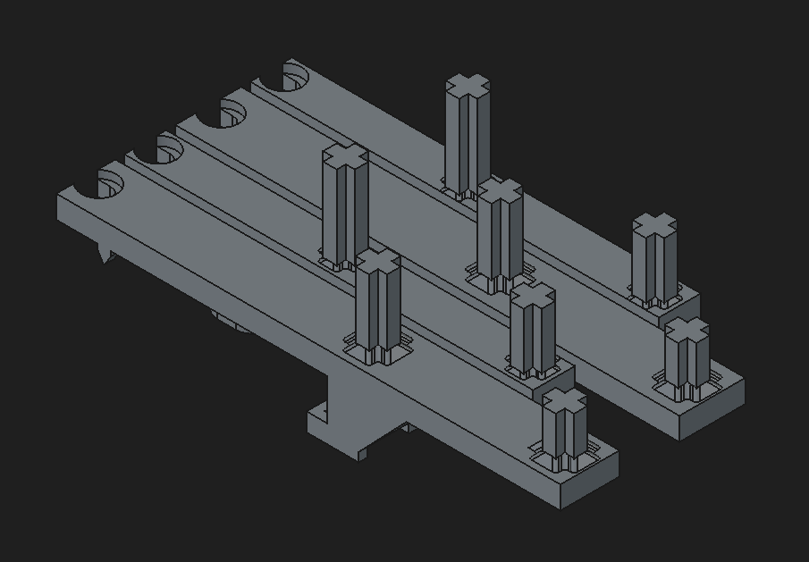
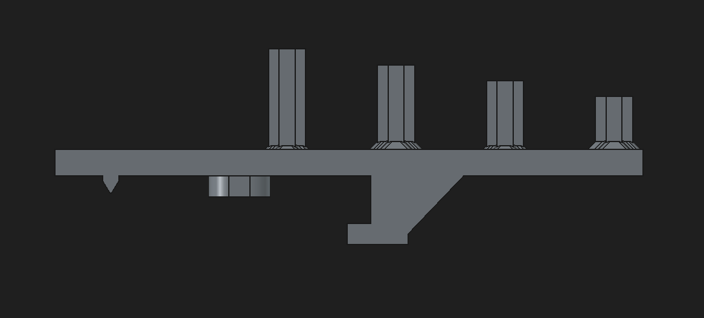
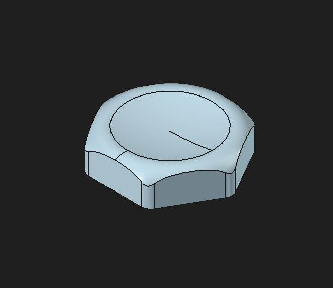

# Arturia Minilab 3 Janko Mod

> A 3D-printed Janko layout keybed replacement for the Arturia Minilab 3.

---

This is a Janko layout mod for the Arturia Minilab 3, made in FreeCAD. The Janko keyboard layout makes the keys in a hexagon pattern where each row is offset by a half step, making scales and chords the same shape regardless of position in the key bed.

The mod replaces the normal keys with 3D printed Janko keys.

[Demo video!](https://youtube.com/watch?v=jq85WJ6aUpQ)

## BOM

Part | Quantity | Price | Link
--- | --- | --- | ---
3D Printed Keys | 25 | N/A | N/A
3D Printed Keycaps | 50 | N/A | N/A
Arturia Minilab 3 | 1 | ~$100 | [arturia.com](https://www.arturia.com/products/hardware-synths/minilab-3)

**Total:** ~$100 + filament

## Overview

**keys**

| Angle |
|:-----:|
|  |
| **Side** |
|  |
| **Top** |
|  |
|  |
| **Cad** |
| **Angle** |
|  |
| **Side** |
|  |
| **Keycap** |
|  |

**Zine**

